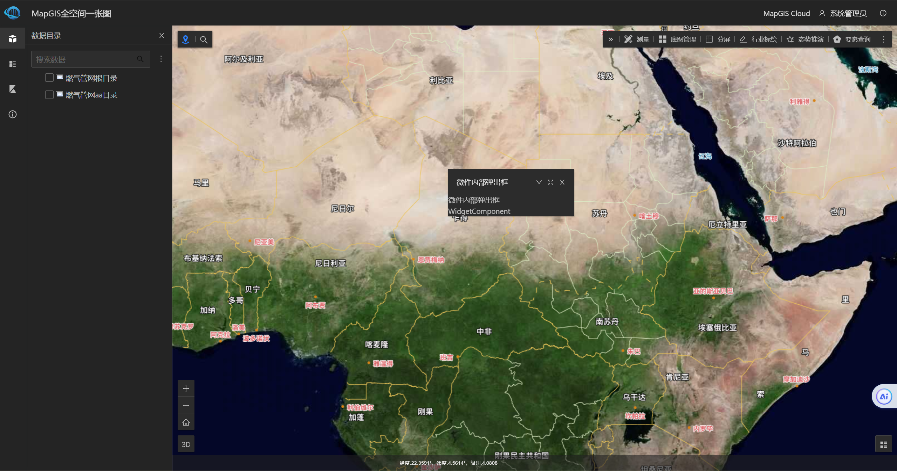

# 目录结构

```plain
|── src
   |── widgets                              # 微件
      |── kuo-zhan-wei-jian-mu-lu           # 扩展微件目录
         |── kuo-zhan-wei-jian              # 扩展微件插件文件夹
            |── kuo-zhan-wei-jian.vue       # 扩展微件插件
      |── index.js                          # 扩展微件目录里插件导出文件
   |── index.ts                             # 项目入口文件
|── .editorconfig                           # editor配置
|── .eslintignore                           # ESlint忽略路径
|── .eslintrc.js                            # ESlint配置
|── .gitignore                              # GIT忽略路径
|── .prettierrc                             # 代码格式化配置
|── babel.config.js                         # babel配置文件
|── package.json                            # npm脚本和依赖项
|── README.md                               # 您的网站/应用程序的自述文件
|── tsconfig.json                           # ts配置
|── vue.config.js                           # vue配置文件
```

# 安装依赖及打包

从 GitLab 上拉取 mapgis-pan-spatial-map-widgets-frame 代码，执行 yarn 命令安装依赖

```
yarn
```

执行 yarn build 命令进行打包，打包后文件输出至 dist-libs 目录下

```
yarn build
```


# 引入方式

支持 src 引入及 dist-libs 两种引入方式，默认情况下为 dist-libs 引入。如需修改为 src 引入方式，可在 package.json 文件当中修改"main"为"main1"，"module1"为"module"，以下截图方式。**src 方式引入，方便调试，发布请使用 dist-libs 的方式引入**，即修改"main1"为"main"，"module"为"module1"。


# 运行程序

1、在 mapgis-pan-spatial-map-mock-server 目录下执行 yarn mock 命令

```
yarn mock
```

2、在 mapgis-pan-spatial-map-widgets-frame 目录下执行 yarn link 命令

```
yarn link
```

3、在 mapgis-pan-spatial-map-app 目录下执行 yarn link @mapgis/mapgis-pan-spatial-map-widgets-frame

```
yarn link @mapgis/mapgis-pan-spatial-map-widgets-frame
```

4、在 mapgis-pan-spatial-map-app/src/core/use.js 中引入@mapgis/mapgis-pan-spatial-map-widgets-frame，并Vue.use引入的库。如果有样式文件还需引入样式文件。


5、在 mapgis-pan-spatial-map-app 目录下执行 yarn serve 命令

```
yarn serve
```

在前台页面可以看见微件显示效果



# 微件扩展指南

详见 [微件扩展指南](./docs/微件扩展指南.md)

