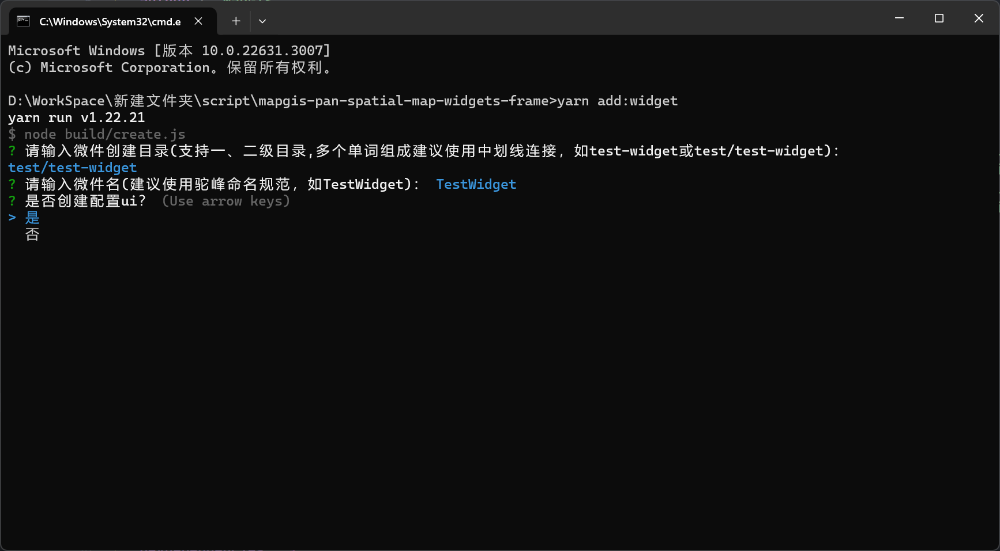
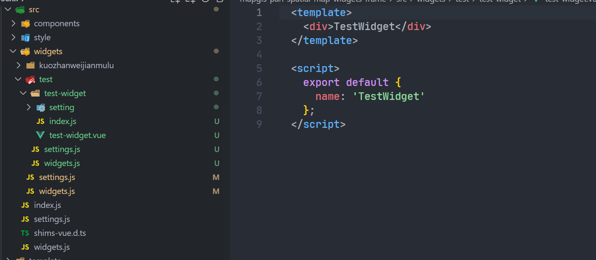
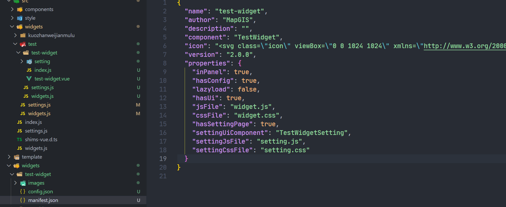
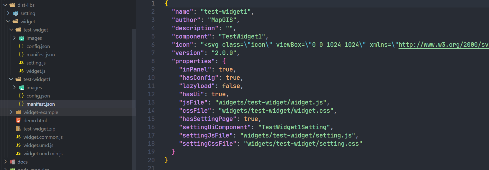

## 微件开发

- 安装依赖

  ```
  yarn
  ```
- 执行快速添加微件脚本命令

  为了节省开发者开发时的重复工作，脚手架新增快速添加微件的脚本命令，让开发者专注于代码的编写

  ```
  yarn add:widget
  ```
- 根据提示输入信息

  
- 通过向导生成目录结构

  根据向导操作后生成如下目录，微件内容则需要开发者自行编写。需要注意的是，微件目录在向导上最多只支持两级。向导中选择生成配置 ui 组件后会增加 setting 文件夹，配置 ui 组件的编写则在此处。

  
- 添加微件的配置信息

  在 widgets 文件夹中，我们需要对开发的微件进行相关的信息配置，让一张图加载时能够正确识别和加载。

  

  manifest.json

  ```json
  {
    "name": "test-widget",
    "author": "MapGIS",
    "description": "",
    "component": "TestWidget",
    "icon": "<svg class=\"icon\" viewBox=\"0 0 1024 1024\" xmlns=\"http://www.w3.org/2000/svg\" width=\"200\" height=\"200\"><defs><style/></defs><path d=\"M512.931 27.694c-272.167 0-492.8 218.436-492.8 487.891 0 269.456 220.633 487.876 492.8 487.876 272.166 0 492.8-218.42 492.8-487.876-.001-269.455-220.634-487.891-492.8-487.891zm-.653 882.593c-219.298 0-397.059-176.005-397.059-393.119 0-217.099 177.761-393.104 397.059-393.104 219.282 0 397.059 176.005 397.059 393.104 0 217.114-177.776 393.119-397.059 393.119zm-.062-493.116c-26.325 0-47.668 21.146-47.668 47.209l.171 287.621c0 26.078 21.358 47.209 47.684 47.209 26.342 0 47.685-21.131 47.685-47.209l-.171-287.621c-.001-26.064-21.344-47.209-47.701-47.209zm0-171.241c-28.281 0-51.223 22.713-51.223 50.729l.187 1.521c0 28.015 22.942 50.729 51.239 50.729s51.239-22.714 51.239-50.729l-.187-1.521c0-28.016-22.942-50.729-51.255-50.729z\"/></svg>",
    "version": "2.0.0",
    "properties": {
      "inPanel": true,
      "hasConfig": true, // 决定config.json文件是否需要字段。config.json通常记录微件的配置信息
      "lazyload": false,
      "hasUi": true,
      "jsFile": "widget.js", // 微件js文件
      "cssFile": "widget.css", // 微件css文件
      "hasSettingPage": true, // 决定是否存在配置ui字段
      "settingUiComponent": "TestWidgetSetting", // 配置ui组件名
      "settingJsFile": "setting.js", // 配置ui的js文件
      "settingCssFile": "setting.css" // 配置ui的css文件
    }
  }
  ```
- 打包命令

  以上工作完成后执行打包命令将项目进行打包，为了满足调试需求，增加打包成可调式的源码脚本命令

```
yarn build // 正常打包

yarn build:debug // 调试打包
```

- 执行打包脚本后，项目会增加打包后的 dist-libs 文件夹，我们只需要关注其中的widget文件夹即可，在正常情况下，微件打包后生成的 js 和 css 文件默认会放在第一个微件文件夹中(若存在配置ui也会放在第一个微件文件夹中)，所以多个微件的情况下，其他微件的 manifest.json 文件中的 properties 属性对应的文件需要指向第一个微件文件夹中文件的路径，如"widgets/test-widget/widget.js"。若只需要单独的某一个微件，可以按照第一个微件文件夹中的 properties 属性配置，然后将其中的 widget.js 和 widget.css 文件复制到该微件中，然后打包成 zip 即可。

  
- 项目使用

  将按上述步骤打包好的 zip 包通过管理平台的功能菜单**应用管理 -微件管理**进行主题 zip 包的上传操作。上传成功后通过功能菜单**应用管理-应用搭建**对微件进行配置，保存后登录一张图即可看到微件效果。

> 若需要对以此种方式加载的微件进行调试，只需要执行调试打包脚本命令，将对应微件上传配置后进入一张图，打开控制台正常调试即可

- link调试

  在开发过程中若需要实时查看效果，通常使用link的方式进行，使用基本的link操作外，开发者只需要配置好主题的config.json和manifest.json文件即可，然后将对应的微件直接打包，将打包好的 zip 包通过管理平台的功能菜单**应用管理 -微件管理**进行主题 zip 包的上传操作。上传成功后通过功能菜单**应用管理-应用搭建**对微件进行配置，保存后登录一张图即可实时调试。

  ```
  yarn link // 微件脚手架执行
  yarn link '@mapgis/mapgis-pan-spatial-map-widgets-frame' // 主应用中执行
  
  // 主应用中添加
  import widgetsFrame from '@mapgis/mapgis-pan-spatial-map-widgets-frame'
  Vue.use(widgetsFrame)
  ```

> link调试情况下是不需要执行打包脚本的，只需要将widgets目录下需要调试的微件定义好后通过管理平台上传即可
>
> 在执行打包脚本和link的情况下，项目优先使用link模式下的代码
