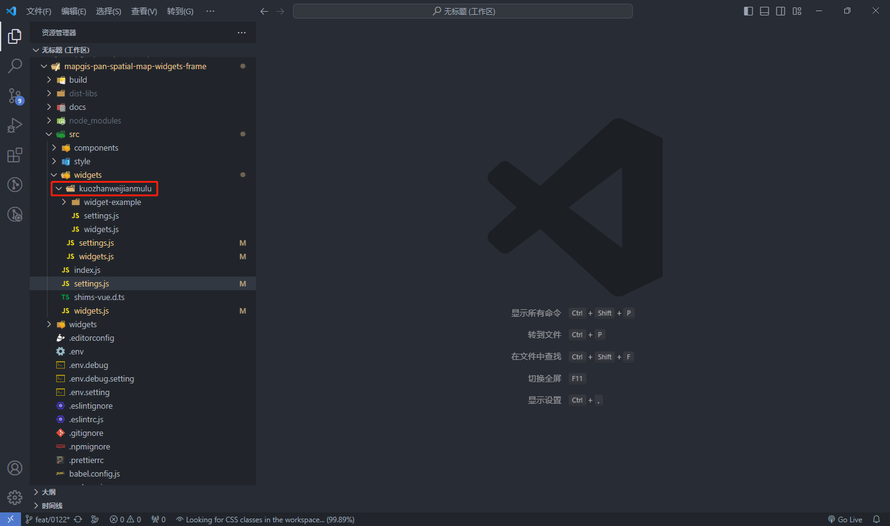
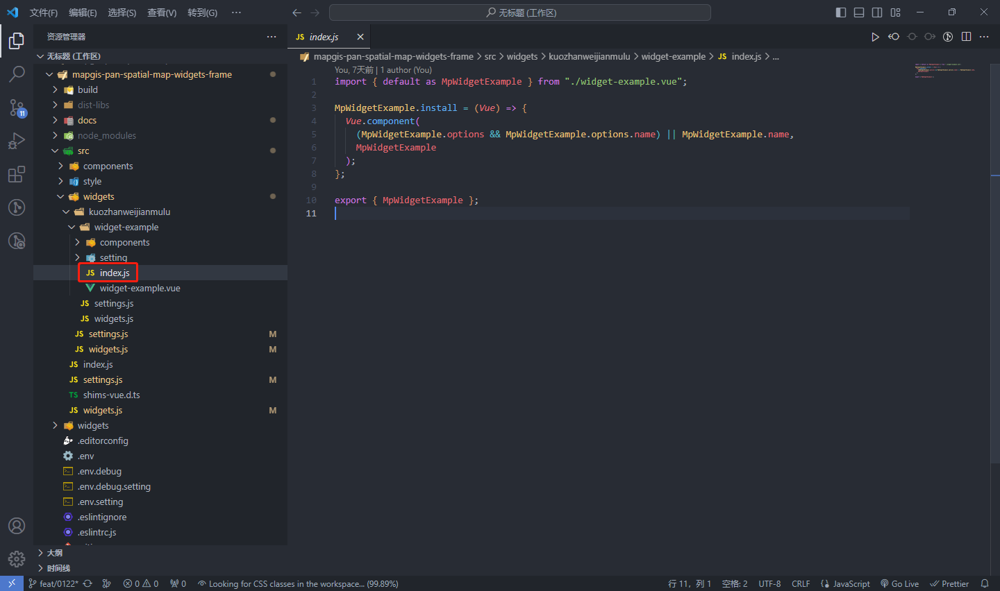
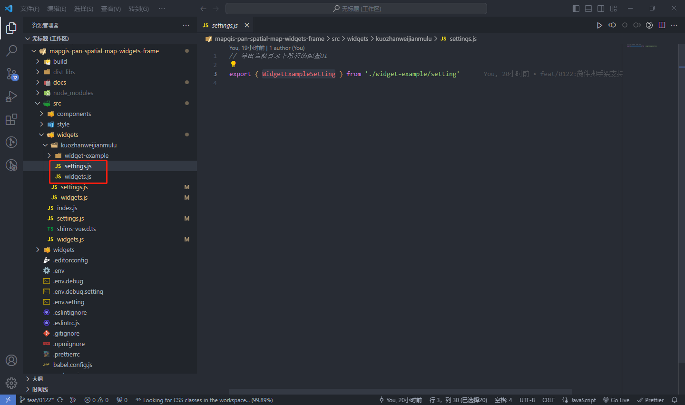
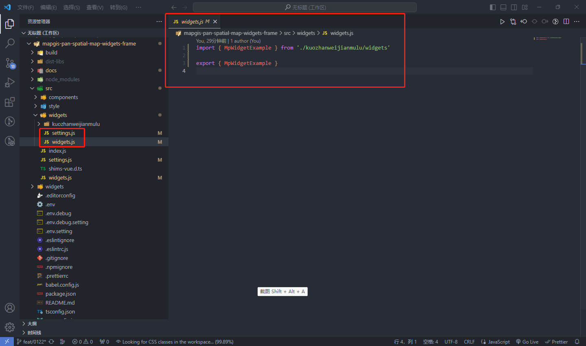

# 运行时微件扩展指南

## 扩展微件目录

在 mapgis-pan-spatial-map-widgets-frame 的 src/widgets 目录下新建目录文件 kuozhanweijianmulu，作为扩展微件专属目录。如果已有可使用分类目录，可省略该步骤。



## 新增微件

1.在 src/widgets/kuozhanweijianmulu/widget-example 文件夹下新建 widget-example.vue 文件

```javascript
<template>
  <div>
    示例微件
    <mp-window-wrapper :visible="true">
      <mp-window
        title="微件内部弹出框"
        :visible="true"
        :vertical-offset="50"
        :max-width="360"
        :has-padding="false"
        anchor="bottom-center"
      >
        <div>
          微件内部弹出框
          <widget-component />
        </div>
      </mp-window>
    </mp-window-wrapper>
  </div>
</template>

<script>
import {
  WidgetMixin,
  LayerType,
  IGSSceneSublayerType,
  LoadStatus,
  api,
  baseConfigInstance,
} from '@mapgis/web-app-framework'
import WidgetComponent from './components/WidgetComponent.vue'

export default {
  name: 'MpWidgetExample',
  components: {
    WidgetComponent,
  },
  // 混入WidgetMixin，可以获取微件的状态及微件生命周期事件，
  // 以及地图对象，在微件中可以直接通过this.XXX获取，
  // 比如this.map(二维地图对象),this.mapbox(MapBox 库),this.viewer(三维场景对象),this.Cesium(Ceisum 库),this.vueCesium(Ceisum vue 对象)
  mixins: [WidgetMixin],
  computed: {
    // 从微件配置里获取ip
    ip() {
      return this.widgetInfo.config.ip || baseConfigInstance.config.ip
    },
    // 从微件配置里获取port
    port() {
      return this.widgetInfo.config.port || baseConfigInstance.config.ip
    },
  },
  /**
   * 动态获取基础目录树上已勾选的三维数据(地形和模型)
   */
  watch: {
    document: {
      immediate: true,
      deep: true,
      handler() {
        if (!this.document) return
        const layers = []
        this.document.defaultMap
          .clone()
          .getFlatLayers()
          .forEach((layer, index) => {
            if (layer.loadStatus === LoadStatus.loaded) {
              if (layer.type === LayerType.IGSScene) {
                if (layer.activeScene) {
                  const { type } = layer.activeScene.sublayers[0]
                  if (
                    type === IGSSceneSublayerType.elevation ||
                    type === IGSSceneSublayerType.modelCache
                  ) {
                    // 剖切分析支持地形和模型
                    layers.push(layer)
                  }
                }
              }
            }
          })
        console.log(layers)
      },
    },
  },
  methods: {
    /**
     * 微件打开事件
     */
    onOpen() {},
    /**
     * 微件关闭事件
     */
    onClose() {},
    /**
     * 微件激活事件
     */
    onActive() {},
    /**
     * 微件不激活事件
     */
    onDeActive() {},
    /**
     * 微件大小被手动调整时，如果微件所在的面板不支持大小调整，则不会响应，如果不支持高度调整，则高度为 undefined。
     * @param width 窗口宽度
     * @param height 窗口高度
     */
    onResize(width, height) {},
    /**
     * 微件切换最大和常规模式时，`max`：最大化；`normal`：常规，如果微件所在的面板不支持窗口模式切换，则不会响应。
     * @param mode 窗口模式
     */
    onWindowSize(mode) {},
    /**
     * 保存微件配置到管理平台
     */
    saveConfig() {
      const { ip, port } = this
      const config = { ip, port }
      api
        .saveWidgetConfig({
          name: 'widget-example',
          config: JSON.stringify(config),
        })
        .then(() => {
          console.log('保存配置成功')
        })
        .catch(() => {
          console.log('保存配置失败')
        })
    },
  },
}
</script>

<style lang="scss" scoped></style>
```

2.在 src/widgets/kuozhanweijianmulu/widget-example 文件夹下新建 index.js 文件用于导出微件



3.在 src/widgets/kuozhanweijianmulu/widget-example 文件夹下新建components文件夹用于存放微件的组件，在components文件夹下新建WidgetComponent.vue文件

```javascript
<template>
  <div>WidgetComponent</div>
</template>

<script>
export default {
  name: "WidgetComponent",
};
</script>

<style lang="scss" scoped></style>

```

4.在 src/widgets/kuozhanweijianmulu/widget-example 文件夹下新建setting文件夹用于存放配置UI模块

​	在setting文件夹下新建widget-example-setting.vue文件

```javascript
<template>
  <div>
    <p>WidgetExampleSetting</p>
    <widget-setting-component />
  </div>
</template>

<script>
import WidgetSettingComponent from './components/WidgetSettingComponent.vue'

export default {
  name: 'WidgetExampleSetting',
  components: {
    WidgetSettingComponent,
  },
}
</script>

<style lang="scss" scoped></style>

```

​	在setting文件夹下新建index.js文件用于导出配置UI


​	在setting文件夹下新建components文件夹存放配置UI的组件，在components文件夹下新建WidgetSettingComponent.vue文件

```javascript
<template>
  <div>WidgetSettingComponent</div>
</template>

<script>
export default {
  name: 'WidgetSettingComponent',
}
</script>

<style scoped></style>

```

5.在 src/widgets/kuozhanweijianmulu下新建widgets.js、settings.js

widgets.js : 导出**当前目录**下所有微件

settings.js : 导出**当前目录**下所有的配置UI



6.在src/widgets文件夹下新建widgets.js、settings.js

widgets.js : 导出**所有**的微件

settings.js : 导出**所有**的配置UI




7.在src/widgets.js文件中导入微件并注册


在src/settings.js文件中导入配置UI并注册


## 微件配置

1.在 widgets里增加 widget-example 文件夹，新建 manifest.json 文件。

```json
{
  // widget的标识名称，需要与widget文件夹的名称一致
  "name": "widget-example",
  // widget的作者
  "author": "MapGIS",
  // widget的描述
  "description": "",
  // widget的组件名，如果inPanel为false，则表示widget本身UI，
  // 如果inPanel为true，其icon会显示到地图占位区域或内容区域中，widget本身UI会展示到Panel中
  "component": "MpWidgetExample",
  // widget图标,默认使用images/icon.svg
  "icon": "<svg class=\"icon\" viewBox=\"0 0 1024 1024\" xmlns=\"http://www.w3.org/2000/svg\" width=\"200\" height=\"200\"><defs><style/></defs><path d=\"M897.706667 1023.573333H178.346667l421.546666-506.026666c180.48 117.76 297.813333 300.373333 297.813334 506.026666z m0-1021.866666H131.413333v919.466666z\"/></svg>",
  // widget的版本，2.0.0表示支持运行时加载的版本
  "version": "2.0.0",
  // widget属性表
  "properties": {
    // 确定widget是否支持2D，默认为true
    "2D": true,
    // 确定widget是否支持3D，默认为false
    "3D": true,
    // 设置widget是否inPanel，如果不在一个panel中，widget会直接展示，默认为true
    "inPanel": true,
    // 设置为true的话，默认加载config文件，反之不加载，默认为true
    "hasConfig": true,
    // 设为为true的话，builder会加载setting页。如果为false并且widget可配置则展示一个Json编辑器
    "hasSettingPage": true,
    // 如果有setting页，settingUiComponent表示设置页ui的组件名
    "settingUiComponent": "WidgetExampleSetting",
    // 设置微件是否懒加载，默认为false，当为true的时候，会在打开微件面板时才会去加载微件，可通过此特性控制初始加载的微件数和内存大小
    "lazyload": false,
    // 设置微件是否有UI，默认为true，当inPanel为false且hasUi也为false时，会自动加载该微件，并由内容区域负责该微件的标识和响应
    "hasUi": true,
    // 微件的js文件名，默认是widget.js，当多个微件共用一个js时，可以指向外部某个微件的jsFile，如："widgets/xxx/widget.js"
    "jsFile": "widget.js",
     // 微件的css文件名，默认是widget.css，当多个微件共用一个css时，可以指向外部某个微件的cssFile,如："widgets/xxx/widget.css"
    "cssFile": "widget.css",
     // 如果微件有配置页，则settingJsFile指向的是配置页的js文件名，默认是setting.js，当多个微件共用一个js时，可以指向外部某个微件的jsFile，比如："widgets/xxx/setting.js"
   "settingJsFile": "setting.js",    
     // 如果微件有配置页，则settingCssFile指向的是配置页的css文件名，默认是setting.css，当多个微件共用一个css时，可以指向外部某个微件的cssFile，比如："widgets/xxx/setting.css"
   "settingCssFile": "setting.css",
  }
}
```

inPanel 为 false 示例

```json
{
  "name": "综合查询",
  "author": "MapGIS",
  "description": "",
  "component": "MpComprehensiveQuery",
  "icon": "<svg class=\"icon\" viewBox=\"0 0 1024 1024\" xmlns=\"http://www.w3.org/2000/svg\" width=\"16\" height=\"16\"><defs><style/></defs><path d=\"M1010.08 885.32L810.66 685.94c-9-9-21.2-14-34-14h-32.6c55.2-70.6 88-159.38 88-255.98C832.06 186.18 645.84 0 416.04 0S0 186.18 0 415.96s186.22 415.96 416.04 415.96c96.6 0 185.42-32.8 256.02-88v32.6c0 12.8 5 25 14 34l199.42 199.38c18.8 18.8 49.2 18.8 67.8 0l56.6-56.6c18.8-18.8 18.8-49.18.2-67.98zm-594.04-181.4c-159.08 0-288-128.68-288-287.96 0-159.06 128.7-287.96 288-287.96 159.08 0 288 128.68 288 287.96 0 159.06-128.7 287.96-288 287.96zm.04-479.92c-81.56 0-147.68 66.1-147.68 147.66 0 65.92 96.52 186.1 133.5 229.72a18.48 18.48 0 0028.36 0c36.98-43.62 133.5-163.78 133.5-229.72 0-81.56-66.12-147.66-147.68-147.66zm0 192c-26.52 0-48-21.5-48-48 0-26.52 21.5-48 48-48s48 21.48 48 48c0 26.5-21.5 48-48 48z\"/></svg>",
  "properties": {
    "2D": true,
    "3D": true,
    "inPanel": false,
    "hasConfig": true,
    "hasSettingPage": true,
    "settingUiComponent": ""
  }
}
```


2.在manifest.json文件的同级目录下新建config.json文件，此文件用于存储微件使用时的配置参数


<h3>打包</h3>

微件编码完成后执行yarn build或者yarn build:debug命令进行打包产生dist-libs文件夹


将dist-libs/widget文件夹下所有的微件文件夹，示例中只有widget-example文件夹打包成widgets.zip文件

### 在全空间一张图中配置主题和微件

全空间一张图后台系统提供微件和主题导入的功能（**应用管理/主题管理、应用管理/微件管理**），将符合微件或主题规范的预开发的微件或主题配置包（xxx.zip）导入到系统中，就可以利用全空间一张图的可视化配置功能（**应用管理/应用搭建**），使用该主题或微件。主题与微件包的格式为`zip`,zip 内为主题或微件的名称，支持 zip 包内包含 1 个或多个主题或微件微件配置包规则。

```
# 以下为主题zip包的内容
├─ theme1                                    // 主题1
│  ├─ mainfest.json                          // 主题清单
│  ├─ layout.json                            // 主题布局
│  ├─ images								 // 图片文件夹
|  |── theme.js                         	 // 主题js文件
|  |── theme.css                        	 // 主题css文件
├─ theme2                                    // 主题1
│  ├─ mainfest.json                          // 主题清单
│  ├─ layout.json                            // 主题布局
│  ├─ images								 // 图片文件夹
​
# 以下为微件zip包的内容
├─ widget1                                    // 微件1
│  ├─ mainfest.json                           // 微件清单
│  ├─ config.json                             // 微件配置【可选，由清单内的hasConfig决定】
│  ├─ images								  // 图片文件夹
│  |── widget.js                       		  // 微件js文件
│  |── widget.css                      		  // 微件css文件
│  |── setting.js                      		  // 微件配置页js文件
│  |── setting.css                     		  // 微件配置页css文件
├─ widget2                                    // 微件2
│  ├─ mainfest.json                           // 微件清单
│  ├─ config.json                             // 微件配置【可选，由清单内的hasConfig决定】
│  ├─ images								  // 图片文件夹
```

## 运行程序

方式一：源码yarn link方式(适用于开发时实时观察编码效果)，特别注意此时必须将mapgis-pan-spatial-map-widgets-frame包当中package.json的软件包入口点改成src/index.js,即采用module的引入方式


1、在 mapgis-pan-spatial-map-widgets-frame 目录下执行 yarn link 命令

```
yarn link
```

2、在 mapgis-pan-spatial-map-app 目录下执行 yarn link @mapgis/mapgis-pan-spatial-map-widgets-frame

```
yarn link @mapgis/mapgis-pan-spatial-map-widgets-frame
```

3、在 mapgis-pan-spatial-map-app/src/core/use.js 中引入@mapgis/mapgis-pan-spatial-map-widgets-frame


5、在 mapgis-pan-spatial-map-app 目录下执行 yarn serve 命令

```
yarn serve
```

在前台页面可以看见微件显示效果


方式二：运行时引入，将打包产生的dist-libs/widget文件夹下所有的微件文件夹压缩成widgets.zip然后在管理平台【应用管理】-【微件管理】进行导入，导入成功后在【应用搭建】将导入的微件进行配置，配置完成后打开一张图即可查看微件显示效果
